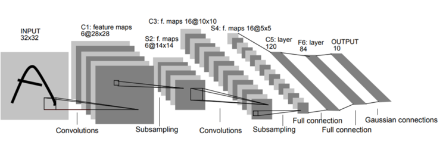
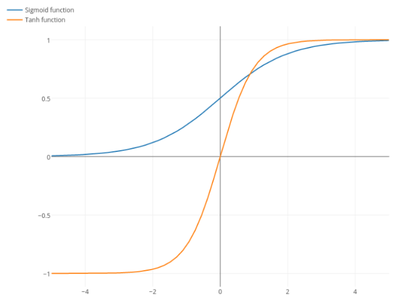
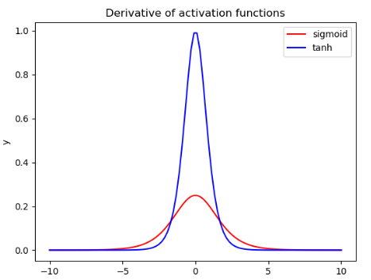
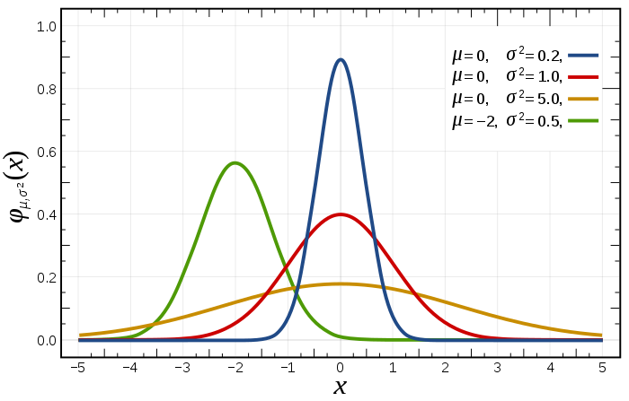

# Lenet

---

LeNet은 1998년 LeCun에 의해 제안된 딥러닝 구조로, 손글씨 숫자 이미지 인식을 위한 구조이다.

LeNet은 0~9까지의 숫자를 분류하는 작업을 수행해야 하기에, 마지막 출력층에서 0~9까지의 숫자를 분류하는 작업을 수행한다.

---

Subsampling : Max Pooling 사용

Activation : tanh (초기에는 tanh함수를 많이 사용하다가 현재는 Relu를 많이 사용하는 추세임)

### Sigmoid와 tanh의 차이

### tanh와 sigmoid의 도함수 그래프에서 기울기 차이

tanh 함수는 sigmoid 함수보다 기울기 변화가 더 크기 때문에 역전파 과정에서 더 잘 수렴할 수 있도록 도와준다.

활성화 함수에서 기울기가 크다는 것은 해당 함수의 출력값이 입력값의 작은 변화에 민감하게 변화한다는 것을 의미한다. 이는 모델이 작은 차이점을 더 잘 파악할 수 있도록 도와준다. 따라서, 기울기가 큰 활성화 함수는 모델이 더 빠르고 정확하게 최적화되도록 도움을 준다.

하지만, 입력값이 너무 크거나 작을때 기울기 소실이 발생할 수 있고, 혹은 입력값이 0에 너무 가까워 기울기가 커 버리면 업데이트의 크기도 커지는 것을 의미하므로, 기울기 폭주 문제 또한 발생할 수 있다.

그러한 이유로, 현재는 Relu가 많이 사용하는 추세이다.

---

마지막 층에 있는 Gaussian Connection은 Gaussian filter를 활용하여 이미지의 노이즈를 줄일 수 있고, 세부 정보를 더욱 확실하게 추출할 수 있다.

### Gaussian은 정규 분포를 뜻한다.

Gaussian Connection Layer의 주된 목적은 공간 불변성을 제공하는 것이다.

공간 불변성이란, 입력 이미지의 작은 변화가 출력층의 뉴런 활성화 값에 큰 영향을 미치지 않는 성질을 의미한다. 예를 들어, 입력 이미지가 회전하거나 이동하더라도 출력층에서는 동일한 특징이 추출되어야 하는것을 말한다.

하지만 여기서 의아한게, tanh의 도함수 그래프를 보면 기울기가 상당히 큰데 이는 작은 변화에도 민감하게 반응하는것을 의미한다. 하지만, Gaussian Connection Layer의 주된 목적이 공간 불변성을 제공하는 것이라면, 굳이 tanh 함수를 활용해서 작은 변화에 예민하게 만들고 Gaussian Connection을 활용하여 작은 변화에 둔감하게 만들어야 하는 이유가 있을까 라고 생각하였다.

하지만, 1998년에 사용되었던 방법이고 Relu도 없었을 뿐더러 그 당시의 기술의 한계라고 판단하는게 맞을 것 같다.

---